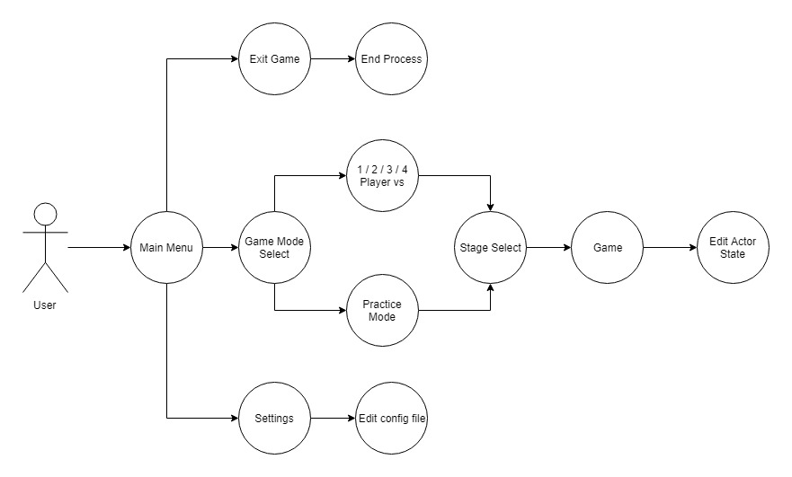
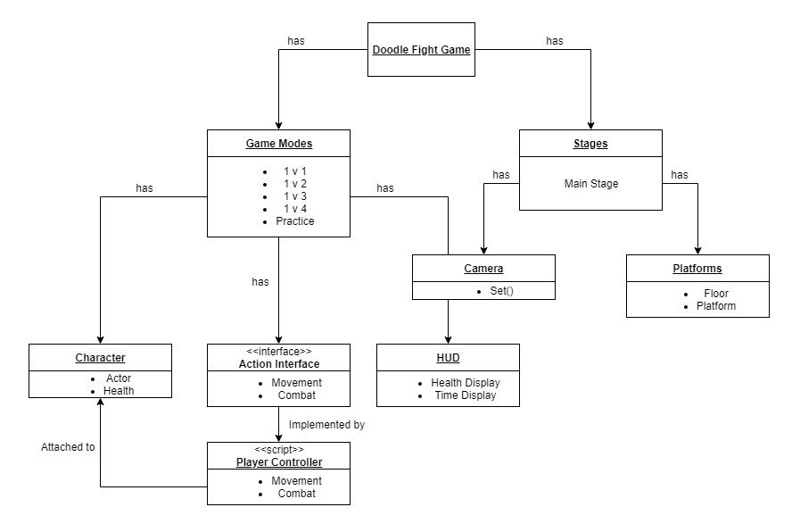
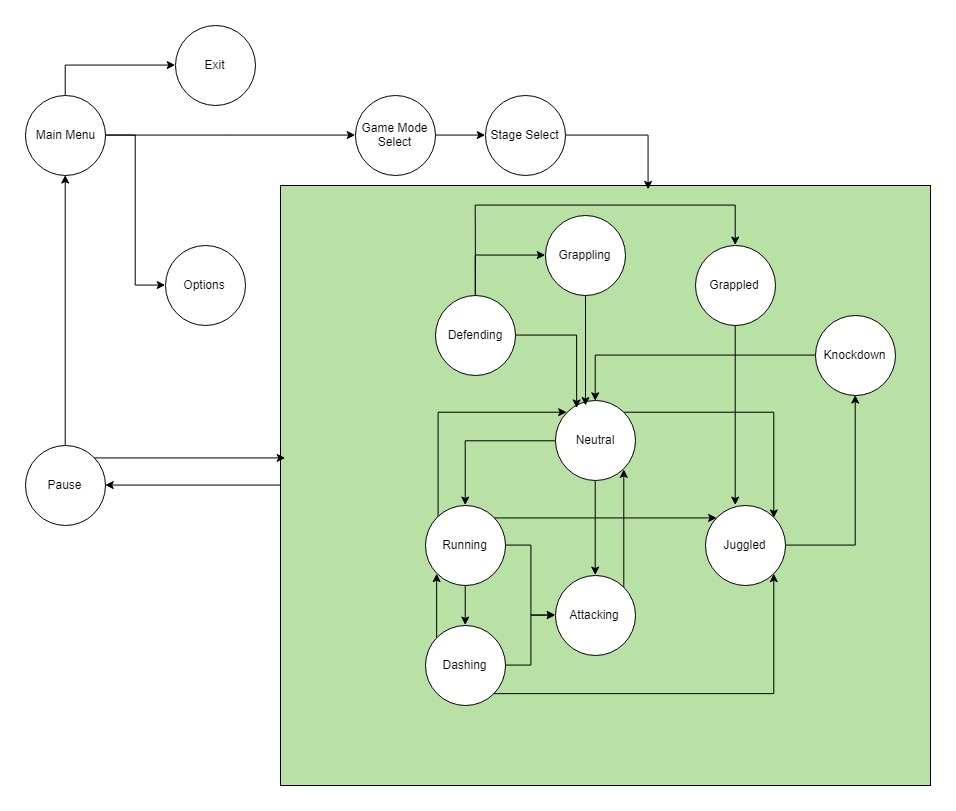

# 6.1. Introduction

This document presents the architecture and detailed design for the software for the Doodle Fight application. Doodle Fight is a 2D fighting game that users will be able to download and play on both Mac/PC.

## 6.1.1     System Objectives

The objective of Doodle Fight is to provide a game client that allows for users to perform combat in a free-for-all format. The Doodle Fight game client is comprised of a menu system, including a game mode select, stage select, settings, and core playable game. The user will be able to navigate the menu system to select the game mode and stage to enter the core game.

## 6.1.2     Hardware, Software, and Human Interfaces

| Interface Type  | Interface Description |
|-----------------|-----------------------|
| Human Interface | Mouse & Keyboard  |
| Human Interface | Monitor |
| Human Interface | Game Controller |
| Software Interface | Menu Interface |
| Software Interface | Game Client |
| Hardware Interface | Unity Engine |

# 6.2 Architectural Design

## 6.2.1     Major Software Components

Looking at our [Requirements Specifications Document.](RequirementsSpecifications.md) , the major software subsystems are the different menu interfaces and the core game. The Top Level Menu user interface includes the File Selection Menu, the World Selection Menu, and the Settings Menu. The Core Game has an informative HUD interface and Pause/Continue Menu Screens. The Core Game provides the majority of the application to the user; it is where the user interacts with the game, including the Movement, Combat, and Health systems.

## 6.2.2 Major Software Interactions

Doodle Fight does not link multiple softwares, and therefore does not have interactions between them to list.

### 6.2.3. Architectural Design Diagrams

#### Use-Case
The user's interactions with the software starts with the menu. The Use-Case Diagram below shows how the user can navigate the main interfaces of our application.

#### Top-Level

The diagram below describes our system at a top-level. And the overall class structure of Doodle Fight's relevant Game Objects

#### Game State

Since Doodle Fight does not interact with external software and is contained within a package exported from Unity, this is a Game State Diagram that describes the different states the user will be in when accessing both the menu and game client.

# 6.3 CSC and CSU Descriptions

This section of the document provides a detailed description of the software for the Doodle Fight game application as described in the [Requirements Specifications Document.](requirements-specifications.md)

## 6.3.1 Detailed Class Descriptions Section

The following section provides the details of all the classes used in the Doodle Fight application.

### 6.3.1.1 Versus/Practice Game Modes CSC Description

The Versus/Practice Game Modes, better known as the “Core Game” in our Requirements Specification Document, is a Class that implements other classes and interfaces to provide the user with a playable game. The Core Game comprises the majority of the application, with the exception of the Main Menu.

#### 6.3.1.1.1 Platforming System CSU Description

The platforming system contains classes that encompass different types of platforms, such as default platforms and floating platforms.

* Floor Platform Class: Basic terrain for the character to traverse
* Floating Platform Class: Terrain that floats in the stage which the character can both stand on or pass through

#### 6.3.1.1.2 Movement System CSU Description
The Movement system allows for the player to move their controlled character.

* Running: Allows the character to move horizontally across the stage.
* Jumping: Allows the character to move vertically within the stage.
* Dashing: Allows the character to quickly move from one point to another horizontally. Faster than running, but leaves the character open for most attacks.

#### 6.3.1.1.3 Combat System CSU Description

The Combat System allows the character to attack and defend themselves from opponent attacks.
* Basic Attack: Spawns a hitbox and lightly knocks up an opponent that it comes in contact with
* Special Attack: Fires a projectile, must be charged up with Basic Attacks and successful Blocks
* Guarding: Allows the character to block incoming Basic and Special attacks
* Grappling: Allows the user to grab an opponent. Cannot be blocked. Upon a successful grapple, the user can throw the grappled opponent in a direction of their choosing.

#### 6.3.1.1.4 Health System CSU Description

The Health System affects how many more hits a character can take as well as how far the character travels when thrown.

## 6.3.2. Detailed Interface Descriptions Section

The following section provides the details of all the interfaces used in the Doodle Fight application.

### 6.3.2.1 Main Menu Interface CSC Description
The Main Menu contains the base for various interfaces within the game including game mode selection, stage selection, settings, and exit application button.

#### 6.3.2.1.1 Game Mode Menu CSU Description
Allows the player to choose whether they fight 1, 2, or 3 opponents. Alternatively, the player may choose to enter a sandbox practice mode.

#### 6.3.2.1.2 Stage Selection Menu CSU Description
The Stage Selection Menu allows the user to choose which stage to do combat in.

#### 6.3.2.1.3 Settings Menu CSU Description
The Settings Menu allows the user to change the settings of the game. Methods include:
* Change game controls
* Change sound volume

#### 6.3.2.1.4 Pause Menu CSU Description
The Pause Menu displays after the user pauses the game, giving the user these options:
* Go back to Game
* Go back to Main Menu
* Open Options Menu

#### 6.3.2.1.5 Exit Game Button CSU Description
The exit game button closes the application.

### 6.3.2.2 Core Game Interfaces CSC Descriptions
The Core Game Interface describes the interfaces that appear in game to the user while in play.

#### 6.3.2.2.1 Health System CSU Description
The Health System contains our Health/Damage Interface.
* Describes the user interface displaying the health bar.
* Informs the character of how much health they have remaining.

## 6.3.3 Detailed Data Structures Description Section
Hashtables will be used to store the various character hitboxes.

# 6.4 Database Design and Description

Since my project operates off of Unity, all of the assets and data are stored in engine. The project is packaged and run using the engine provided. Therefore, Doodle Fight is not using any external database or software.
